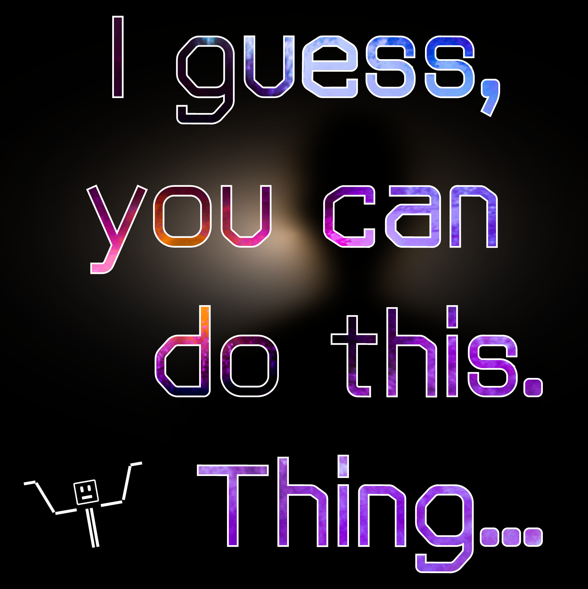
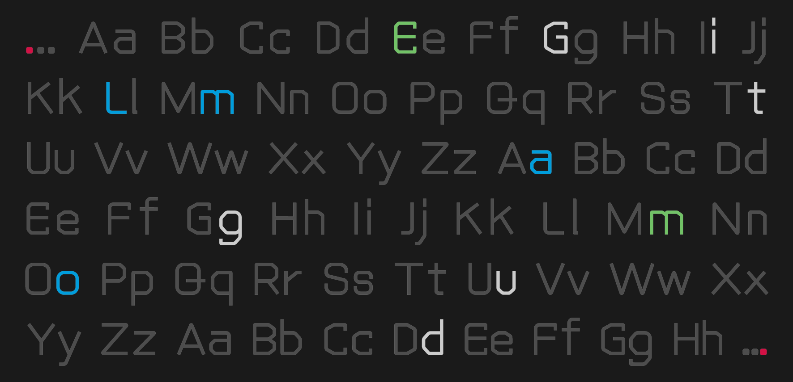

# Console Boogeyman

  

#### <a href="https://github.com/JakubovBrloh/Console-Boogeyman/releases"> 
<u style="text-decoration: underline dashed 1px">Download here</u>
</a>

## Contents
1. [About](#about)
1. [Image Examples](#image-examples)
1. [Bugs](#bugs)
1. [Suggest Improvement](#suggest-improvement)
1. [License & Copyright](#license-and-copyright)
1. [Commercial Usage](#commercial-usage)

## About
<i><b>Console Boogeyman</b></i> is cross of geometric and neo-humanist sans-serif inspired by sans-serif japanese-like latin fonts (like from Nintendo games); and some other fonts (like Terminus, Sys…).
 <i><b>Console Boogeyman</b></i> has support for all latin-european languagues.

<b>Console Boogeyman</b> has only one set of typeface. Meaning that <b>Console Boogeyman</b> doesn't have/include <i>italics</i> nor <b>bolds</b>. (Sadly ☹)
  Font was made with <a href="https://nebukam.github.io/mkfont/" style="color: #3DC187"><b>MkFont</a></b>.

## Image Examples

  

  

## Bugs
Only encountered bug I've found is either missing or incorrect rendering of U+2329 & U+232A characters (Right- & Left-Pointing Angle Brackets " <b>〈 〉</b> "). 

To report a bug, open an issue (please check if a similar issue exists first).

## Suggest Improvement
To suggest an improvement or fix, open an issue (please check if a similar issue exists first).

If you would like to contribute to this project, please contact me first via my e-mail.

## License and Copyright

Console Boogeyman by <a rel="cc:attributionURL dct:creator" property="cc:attributionName" href="https://linktr.ee/Jakubov_Brloh">Jakub Urbaník</a> is licensed under <a href="https://creativecommons.org/licenses/by-nc-sa/4.0/?ref=chooser-v1" target="_blank" rel="license noopener noreferrer" style="display:inline-block;"><i>CC BY-NC-SA 4.0</i></a>

Copyright © 2024 Jakub Urbaník (<u style="color: #4DAAFC">jakub.brloh.urbanik@gmail.com</u>)

## Commercial Usage
If you want to use Console Boogeyman in any kind of form of commercial media, contact me at: 
 " <b><i><u style="color: #4DAAFC">jakub.brloh.urbanik@gmail.com</b></i></u> ".
